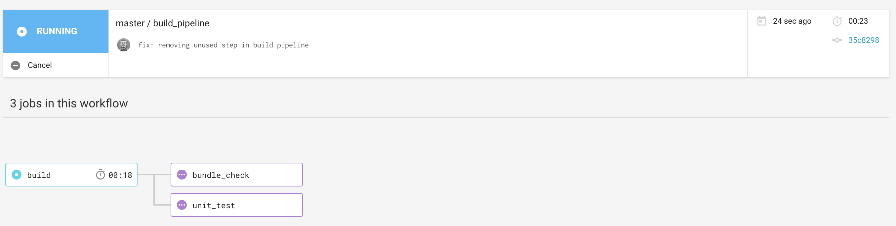

# Reactor Email Page

> Email Page to be used with the Reactor Email Facade API


[](https://circleci.com/gh/willmendesneto/reactor-email-page)
[](https://coveralls.io/github/willmendesneto/reactor-email-page?branch=master)


## Frameworks, Libraries and Tools

- POI.JS as zero-config bundler for JavaScript applications;
- ReactJS as JavaScript library for building user interfaces;
- NPM as dependency manager;
- Mocha as test framework;
- Sinon as Standalone test spies, stubs and mocks;
- Chai as BDD/TDD assertion library;
- NYC as code coverage tooling;
- Node Fetch as HTTP client;


## Running the project locally

This project depends of [reactor-email-facade](https://github.com/willmendesneto/reactor-email-facade) to be running in your local computer. So you need to follow the steps to run that locally.

### What about the CORS issue locally?

It's required a plugin in your browser to run that locally. I recomend you to use [Allow-Control-Allow-Origin: *](https://chrome.google.com/webstore/detail/allow-control-allow-origi/nlfbmbojpeacfghkpbjhddihlkkiljbi?hl=en) in case Google Chrome is your browser or look for some similar plugin in your computer


## How to install

### Manual installation

Make sure that you are using the NodeJS version is the same as `.nvmrc` file version. If you don't have this version please use a version manager such as `nvm` or `n` to manage your local nodejs versions.

> Please make sure that you are using NodeJS version 6.10.2

Assuming that you are using `nvm`, please run the commands inside this folder:

```bash
$ nvm install $(cat .nvmrc); # install required nodejs version
$ nvm use $(cat .nvmrc); # use nodejs version
$ npm install
```

In Windows, please install NodeJS using one of these options:

Via `NVM Windows` package: Dowload via [this link](https://github.com/coreybutler/nvm-windows). After that, run the commands:

```bash
$ nvm install $(cat .nvmrc); # install required nodejs version
$ nvm use $(cat .nvmrc); # use nodejs version
$ npm install
```

Via Chocolatey:

```bash
$ choco install nodejs.install -version v8.9.3
```


## Publishing the package

This project is using `np` as publisher helper. So there are some automated tasks that will be triggered when `np` runs:

- Run the tests and check if the code coverage are on the expected values;
- Check if the changelog has the required updates to automate the `CHANGELOG.md` file update;
- Check for the bundlesize;
- Create the bundle files;

For more information, please check [`np` documentation](https://github.com/sindresorhus/np#readme) to check all the NPM events that are triggered.


## NPM Commands

### Component commands

- `npm run start`:  start component page example using [`react-storybook`](https://github.com/storybooks/storybook);
- `npm run watch`:  start component page in watch mode example using [`react-storybook`](https://github.com/storybooks/storybook),
- `npm run demo:deploy`: Publishing your component page in your Github Page
- `npm run build:page`: Creates your page bundle;
- `npm run build:library`: Creates your component bundle to be published in your NPM repository (public or private). This bundle will NOT include [`react-storybook`](https://github.com/storybooks/storybook) and other development dependencies;
- `npm run serve:dist`: Creates a server based on the component page that will be deployed in your Github Page. This command is used to check the results locally before you deploy your component example page;
- `npm run test`: Running unit tests using MochaJS
- `npm run tdd`: Running unit tests using MochaJS in watch mode. It will help you to create a component using [`Test Driven Development` approach](https://en.wikipedia.org/wiki/Test-driven_development)


## Circle CI Pipeline Model

This project is using Circle CI to run all the automated tasks/validations. This is the current build pipeline which runs if someone sends a new Pull Request or master is updated.





## Improvements

These are the list of the tech debt / improvements for this project

- [] Improve the local setup. Currently, we have API and Frontend separated in different repositories to have automated validations easier, simulating a real microfrontend scenario. However it increases complexity to run that locally. Create a `docker-compose.yml` with this setup can be helpful;
- Improve User experience. Currently, the page split the emails based on the `,` separator, which can be improved if we use dynamic inputs. But as the first version we can validate the idea and improve as it goes. Another point is related to the loading component, which can give better experience with [small actions in the buttons](https://tubikstudio.com/ux-practices-8-solid-tips-on-cta-button-design/); 
- [] Add different layers of test, such as performance and E2E tests;
- [] Add more scenarios for the StorybookJS, simulating how the components should work in different cases;
- [] Service discovery integration with the API, such as `consul`, with fallback for `.env`. This will make the application decoupled with the code and configuration, avoiding unnecessary deployment in case of the configuration changes;


## Changes and history

See [CHANGELOG.md](./CHANGELOG.md).


## Author

**Wilson Mendes (willmendesneto)**
+ <https://plus.google.com/+WilsonMendes>
+ <https://twitter.com/willmendesneto>
+ <http://github.com/willmendesneto>
